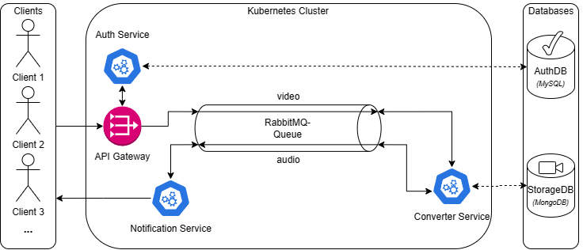

<a name="readme_top"></a>

# File Converter Microservice Architecture

A simple microservice-project for converting video files to mp3 files with authentification via JSON Web Token using kubernetes (with minikube) and docker for orchestration. The project is based on [a tutorial](https://www.youtube.com/watch?v=hmkF77F9TLw) by [@kantancoding](https://github.com/kantancoding). (his [repo](https://github.com/kantancoding/microservices-python)) I made some changes for keeping it up to date and to make it more understandable for me.

## 🔢 Getting Started

Requirements:

- [Docker](https://www.docker.com/get-started/) installed
- [kubectl](https://kubernetes.io/de/docs/tasks/tools/install-kubectl/) installed
- [minikube](https://kubernetes.io/de/docs/tasks/tools/install-minikube/) installed
- [MySQL](https://dev.mysql.com/doc/refman/8.0/en/installing.html) installed
- [Python3](https://realpython.com/installing-python/) installed
- [k9s](https://k9scli.io/topics/install/) or something similar installed

Procedure:

1.  Clone the repository
    ```sh
    git clone https://github.com/MhouneyLH/file_converter_microservices.git
    ```
2.  When you want to work for a specific microservice, you should use the virtual environment
    ```sh
    cd <microservice-directory>
    source venv/bin/activate
    ```
3.  Start Docker
    ```sh
    sudo systemctl start docker
    ```
4.  Start minikube

    ```sh
    minikube start
    ```

5.  **First time:** Adjust `/etc/hosts` (So we can use the domain names for the services)

    ```sh
    echo "127.0.0.1 mp3converter.com" | sudo tee -a /etc/hosts
    echo "127.0.0.1 rabbitmq-manager.com" | sudo tee -a /etc/hosts
    ```

6.  **First time:** Enable Ingress for minikube
    ```sh
    minikube addons list
    minikube addons enable ingress
    ```
7.  Start minikube tunnel (for exposing the services on a specific ip address)

    ```sh
    minikube tunnel --bind-address "127.0.0.1"
    ```

8.  Use something like [k9s](https://k9scli.io/) for monitoring the cluster.

    ```sh
    k9s
    ```

9.  Initialize the local MySQL database. (for auth)

    ```sh
    mysql -u root < ./src/auth/init.sql
    ```

10. Apply all manifests in the `./src` directory.

    ```sh
    kubectl apply --recursive -f ./src

    # OR

    kubectl apply -f ./src/auth/manifests
    kubectl apply -f ./src/converter/manifests
    kubectl apply -f ./src/notification/manifests
    kubectl apply -f ./src/gateway/manifests
    kubectl apply -f ./src/rabbitmq/manifests
    kubectl apply -f ./src/mongodb/manifests
    ```

<p align="right">(<a href="#readme_top">back to top</a>)</p>

## 🔢 Usage

You can use any tool you want for making HTTP-Requests. I just used [curl](https://curl.se/) for testing the services.

1. Get a JSON Web Token for authentication

   ```sh
   curl -X POST http://mp3converter.com/login <your_defined_email_address>:<your_defined_password>
   ```

2. Upload a `.mp4` or `.mkv` file (with audio).

   ```sh
   curl -X POST -F 'file=@<path_to_file>' -H 'Authentification: Bearer <your_json_web_token>' http://mp3converter.com/upload
   ```

3. Now you should get a message with an id to your in `./src/notification/manifests/configmap.yaml` defined email address. ([Create an app password in your google account settings and use it for the email password](https://support.google.com/accounts/answer/185833?hl=de))

4. Download the converted file.

   ```sh
   curl --output <path_for_downloaded_file> -X GET -H 'Authorization: Bearer <your_json_web_token>' "http://mp3converter.com/download?fid=<id_from_notification>"
   ```

<p align="right">(<a href="#readme_top">back to top</a>)</p>

## 📦 Architecture and explanation

> I also have some more notes [here](./assets/NOTES.md). (but they are a bit messy and bilingual)



### Auth Flow

1. User signs up with email and password (Basic Access Authentication)
2. Auth-service creates a JWT
3. Auth-service encrypts this JWT with the private key (see `./src/auth/manifests/secret.yaml` for the secret)
4. JWT comes back to client
5. Client makes request to gateway with JWT (uploading a file)
6. Gateway checks if JWT is valid (with private key) using the auth-service
7. Gateway checks if user is admin (with payload of JWT) using the auth-service (at the moment just false / true)

### Information Flow

1. User authenticates (see Auth Flow)
2. User uploads a file to the gateway
3. Gateway stores the file in MongoDB
4. Gateway sends a message to RabbitMQ, that a file was uploaded (queue=`video`)
5. Converter-service takes the message from the queue and knows the ID of the video in MongoDB
6. Converter-service converts the video to mp3
7. Converter-service stores the mp3 in MongoDB
8. Converter-service sends a message to RabbitMQ, that a mp3 was created (queue=`mp3`)
9. Notification-service takes the message from the queue and knows the ID of the mp3 in MongoDB
10. Notification-service sends an email to the user with the download link
11. User can download the mp3 from the gateway (with the ID of the mp3 and the JWT)

### Why using MongoDB for storage?

- with MongoDB you can store files up to 16MB
  -> problem = videos are mostly > 16MB
- Solution = Use GridFS for storing files > 16MB (file is split into smaller files and stored in MongoDB)

<p align="right">(<a href="#readme_top">back to top</a>)</p>

## 🐛 Known Issues and Bugs

- the mongodb database running in the cluster is not persistent (so if you delete the pod, the data is lost)
- the rabbitmq database running in the cluster is not persistent (so if you delete the pod, the data is lost)
- when you get the message from the queue, that some connection got reset (mostly after e. g. purging the queue or restarting the service) you also have to restart the gateway service (something because of the routing via service name in the code)

<p align="right">(<a href="#readme_top">back to top</a>)</p>

## 👨🏻‍💼 Contributing

Contributions are always welcome! Please look at following commit-conventions, while contributing: https://www.conventionalcommits.org/en/v1.0.0/#summary 😃

1. Fork the project.
2. Pick or create an [issue](https://github.com/MhouneyLH/deskify/issues) you want to work on.
3. Create your Feature-Branch. (`git checkout -b feat/best_feature`)
4. Commit your changes. (`git commit -m 'feat: add some cool feature'`)
5. Push to the branch. (`git push origin feat/best_feature`)
6. Open a Pull-Request into the Develop-Branch.

<p align="right">(<a href="#readme_top">back to top</a>)</p>
